# 🏥 RAG-MediBot — Role-Aware Medical RAG Chatbot

A production-style Retrieval-Augmented Generation (RAG) chatbot for **MediAssist Hospital**, featuring **role-based document access control**, **hybrid vector search**, and **SQL-based structured data queries**. The system enforces that users only retrieve documents their role is authorized to see.

---

## 📋 Table of Contents

- [Architecture Overview](#architecture-overview)
- [Folder Structure](#folder-structure)
- [Technology Stack](#technology-stack)
- [Setup & Installation](#setup--installation)
- [Environment Variables](#environment-variables)
- [Running the Application](#running-the-application)
- [Hardcoded Users & Roles](#hardcoded-users--roles)
- [Role-Based Document Access](#role-based-document-access)
- [Data Collections](#data-collections)
- [Request Flow](#request-flow)
- [API Endpoints](#api-endpoints)
- [RAG Pipeline Details](#rag-pipeline-details)
- [Screenshots](#screenshots)
- [Adversarial Prompt Examples](#adversarial-prompt-examples)

---

## Architecture Overview

```
┌─────────────────────────────────────────────────────────────────┐
│                        FRONTEND (Next.js)                       │
│              http://localhost:3000                               │
│   ┌──────────────┐          ┌──────────────────────────────┐   │
│   │  /login page │          │       /chat page              │   │
│   └──────┬───────┘          └──────────────┬───────────────┘   │
└──────────┼───────────────────────────────── ┼───────────────────┘
           │  POST /login                     │  POST /chat
           ▼                                  ▼
┌─────────────────────────────────────────────────────────────────┐
│                     BACKEND (FastAPI)                           │
│              http://127.0.0.1:8000                              │
│                                                                 │
│  ┌────────────┐  ┌────────────────┐  ┌────────────────────┐   │
│  │  /login    │  │  /collections  │  │       /chat        │   │
│  │  Auth      │  │  Role Metadata │  │  RAG Orchestrator  │   │
│  └────────────┘  └────────────────┘  └────────┬───────────┘   │
└──────────────────────────────────────────────── ┼───────────────┘
                                                  │
                    ┌─────────────────────────────┤
                    │                             │
                    ▼                             ▼
     ┌──────────────────────────┐   ┌─────────────────────────┐
     │     HYBRID RAG           │   │       SQL RAG            │
     │                          │   │  (admin/billing only)    │
     │  ┌──────────────────┐    │   │                          │
     │  │ HuggingFace      │    │   │  SQLite DB               │
     │  │ Dense Embeddings │    │   │  (claims data)           │
     │  └──────────────────┘    │   │                          │
     │  ┌──────────────────┐    │   │  LangChain SQL Chain     │
     │  │ FastEmbed (BM25) │    │   │  → SQL generation        │
     │  │ Sparse Embeddings│    │   │  → result execution      │
     │  └──────────────────┘    │   │  → natural lang answer   │
     │  ┌──────────────────┐    │   └─────────────────────────┘
     │  │  Qdrant Vector DB│    │
     │  │ (local on-disk)  │    │
     │  └──────────────────┘    │
     │  ┌──────────────────┐    │
     │  │ Cross-Encoder    │    │
     │  │  Re-ranker       │    │
     │  └──────────────────┘    │
     │  ┌──────────────────┐    │
     │  │  Groq LLM        │    │
     │  │ (gpt-oss-20b)    │    │
     │  └──────────────────┘    │
     └──────────────────────────┘
```

---

## Folder Structure

```
RAG-MediBot/
├── api/                          # FastAPI backend
│   ├── main.py                   # App entry point, lifespan startup
│   └── app/
│       ├── config.py             # Role-to-collection access mapping, mock users
│       ├── middleware.py         # CORS configuration (allows localhost:3000)
│       ├── models.py             # Pydantic request/response models
│       ├── routes.py             # API route handlers (/login, /chat, /collections)
│       └── startup.py            # One-time initialization: ingestion, LLM, SQL DB
│
├── rag/                          # RAG pipeline logic
│   ├── llm.py                    # Groq LLM factory (ChatGroq)
│   ├── utils.py                  # Shared helpers: intent classifier (is_analytical_question)
│   ├── hybrid/                   # Hybrid RAG (dense + sparse vector search)
│   │   ├── embedding_store.py    # Store/load chunks to/from Qdrant (dense + BM25 sparse)
│   │   ├── hybrid_prompt.py      # System prompt for hybrid RAG chain
│   │   ├── hybrid_retriever.py   # access_roles-filtered Qdrant retriever
│   │   ├── ingestion_chunking.py # PDF/MD parsing with Docling + HierarchicalChunker
│   │   ├── invoke_llm.py         # Execute hybrid RAG chain, return answer + context
│   │   └── reranker.py           # Cross-encoder re-ranking (ContextualCompression)
│   └── sql/                      # SQL RAG for structured/claims data
│       ├── invoke_llm.py         # Natural language answer from SQL result
│       ├── sql_chain_cleanup_run.py  # build_sql_rag_chain factory + clean_sql helper
│       └── sql_prompt.py         # System prompt for SQL answer generation
│
├── frontend/                     # Next.js 16 chat UI
│   └── src/app/
│       ├── login/                # Login page
│       └── chat/                 # Chat interface
│
├── data/                         # Source documents (organized by collection)
│   ├── billing/                  # billing_codes.pdf, claim_submission_guide.md
│   ├── clinical/                 # diagnostic_reference.pdf, drug_formulary.pdf, treatment_protocols.pdf
│   ├── equipment/                # equipment_manual.pdf
│   ├── general/                  # code_of_conduct.pdf, general_faqs.pdf, leave_policy.pdf, staff_handbook.pdf
│   ├── nursing/                  # icu_nursing_procedures.pdf, infection_control.pdf
│   └── db/
│       └── mediassist.db         # SQLite database (claims data)
│
├── db/
│   └── mediassist_qdrant/        # Qdrant local vector store (auto-created on startup)
│
├── .env                          # Environment variables (not committed)
├── sample.env                    # Template — copy to .env and fill in values
├── pyproject.toml                # Python dependencies (managed with uv)
└── main.py                       # Standalone script for testing RAG chains locally
```

---

## Technology Stack

| Layer | Technology |
|---|---|
| **Frontend** | Next.js 16, React 19 |
| **Backend API** | FastAPI, Uvicorn |
| **LLM** | Groq (`openai/gpt-oss-20b`) via `langchain-groq` |
| **Document Parsing** | Docling `DocumentConverter` + `HybridChunker` (structure-first → token-aware) |
| **Dense Embeddings** | HuggingFace `sentence-transformers/all-MiniLM-L6-v2` |
| **Sparse Embeddings** | FastEmbed BM25 (`Qdrant/bm25`) |
| **Vector DB** | Qdrant (local on-disk mode) |
| **Re-ranker** | `cross-encoder/ms-marco-MiniLM-L-6-v2` (HuggingFace) |
| **SQL Chain** | LangChain `create_sql_query_chain` + SQLite |
| **Package Manager** | `uv` |

---

## Setup & Installation

### Prerequisites

- Python 3.10+ (project targets Python ≥ 3.13 in `pyproject.toml`)
- Node.js 18+ (for the frontend)
- [uv](https://github.com/astral-sh/uv) package manager

### 1. Clone the repo

```bash
git clone <repo-url>
cd RAG-MediBot
```

### 2. Set up Python environment

```bash
uv sync
```

This installs all dependencies from `pyproject.toml` into a `.venv`.

### 3. Configure environment variables

```bash
cp sample.env .env
```

Edit `.env` and fill in your Groq API key (see [Environment Variables](#environment-variables)).

### 4. Install frontend dependencies

```bash
cd frontend
npm install
```

---

## Environment Variables

Copy `sample.env` → `.env` and set the values below. **Never commit `.env`** — it's in `.gitignore`.

| Variable | Default | Description |
|---|---|---|
| `GROQ_KEY` | *(required)* | Your Groq API key — get one at [console.groq.com](https://console.groq.com) |
| `GROQ_MODEL` | `openai/gpt-oss-20b` | Groq model name to use for chat |
| `EMBED_MODEL` | `sentence-transformers/all-MiniLM-L6-v2` | HuggingFace dense embedding model |
| `COLLECTION_NAME` | `hybrid_qdrant_medical` | Qdrant collection name |
| `QDRANT_PATH` | `./db/mediassist_qdrant` | Local path for Qdrant on-disk storage |
| `DATA_PATH` | `./data` | Root path of the document collections |
| `CROSS_ENCODER_MODEL` | `cross-encoder/ms-marco-MiniLM-L-6-v2` | Re-ranker model (configurable, applied at runtime) |
| `DATABASE_PATH` | `./data/db/mediassist.db` | Path to the SQLite claims database |
| `FORCE_REINGEST` | `false` | Set to `true` to force re-parsing all PDFs and rebuilding the vector store on next startup |

**sample.env:**

```env
EMBED_MODEL="sentence-transformers/all-MiniLM-L6-v2"
COLLECTION_NAME="hybrid_qdrant_medical"
QDRANT_PATH="./db/mediassist_qdrant"
DATA_PATH="./data"
GROQ_MODEL="openai/gpt-oss-20b"
CROSS_ENCODER_MODEL="cross-encoder/ms-marco-MiniLM-L-6-v2"
DATABASE_PATH="./data/db/mediassist.db"
GROQ_KEY=""
FORCE_REINGEST="false"
```

---

## Running the Application

> ⚠️ All commands must be run from the **project root** (`RAG-MediBot/`).

### Start the Backend

```bash
uvicorn api.main:app --host 127.0.0.1 --port 8000
```

On **first** startup, the app will:
1. Parse all PDF/Markdown files in `data/` using Docling
2. Embed and store chunks into Qdrant at `./db/mediassist_qdrant`
3. Initialize the Groq LLM and SQL database connection

On **subsequent** restarts, the app detects the existing Qdrant collection and **skips re-ingestion**, loading the existing vector store directly. This means restarts take seconds instead of minutes.

> 💡 To force a full re-ingest (e.g. after adding new documents), set `FORCE_REINGEST=true` in `.env` and restart once. Reset it back to `false` afterwards.

> 🗑️ To wipe and rebuild from scratch, delete the `./db/mediassist_qdrant/` folder and restart.

### Start the Frontend

In a separate terminal:

```bash
cd frontend
npm run dev
```

The app will be available at **http://localhost:3000**.

---

## Hardcoded Users & Roles

Authentication is handled with in-memory mock users defined in [`api/app/config.py`](api/app/config.py). There is no real authentication database.

| Username | Password | Role |
|---|---|---|
| `dr.mehta` | `doctor` | `doctor` |
| `nurse.priya` | `nurse` | `nurse` |
| `billing.ravi` | `billing_executive` | `billing_executive` |
| `admin.sys` | `admin` | `admin` |
| `tech.anand` | `technician` | `technician` |

> ⚠️ These are demo credentials only. Do not use in production.

---

## Role-Based Document Access

Each role can only retrieve documents from specific **collections**. This is enforced at the Qdrant query level using a payload filter (`metadata.collection`).

| Role | Accessible Collections |
|---|---|
| `admin` | general, clinical, nursing, billing, equipment |
| `doctor` | general, clinical, nursing |
| `nurse` | general, nursing |
| `billing_executive` | general, billing |
| `technician` | general, equipment |

If a user asks about a collection they do not have access to, the system returns:

```
As a [role], you do not have access to [restricted collections] documents.
I can only answer questions from the [accessible collections] collections.
```

Additionally, `admin` and `billing_executive` roles automatically fall back to the **SQL RAG** chain when the hybrid vector search returns no useful answer (e.g., for structured claims queries).

---

## Data Collections

Documents live in `data/<collection-name>/`. The subfolder name **determines the collection** and therefore **which roles can access it**.

| Collection | Subfolder | Source Files |
|---|---|---|
| `general` | `data/general/` | code_of_conduct.pdf, general_faqs.pdf, leave_policy.pdf, staff_handbook.pdf |
| `clinical` | `data/clinical/` | diagnostic_reference.pdf, drug_formulary.pdf, treatment_protocols.pdf |
| `nursing` | `data/nursing/` | icu_nursing_procedures.pdf, infection_control.pdf |
| `billing` | `data/billing/` | billing_codes.pdf, claim_submission_guide.md |
| `equipment` | `data/equipment/` | equipment_manual.pdf |

Structured claims data lives in `data/db/mediassist.db` (SQLite) and is queried via the SQL RAG chain.

---

## Request Flow

### Login Flow

```
User enters credentials
        │
        ▼
POST /login
        │
        ├─ Username exists in MOCK_USERS? → No → 401 User not found
        │
        ├─ Password matches? → No → 401 Invalid password
        │
        └─ Yes → return { message, role, username }
                         │
                         ▼
              Frontend stores role in state
              GET /collections/{role} → list of accessible collections
```

### Chat Flow

```
User sends message (with role in request)
        │
        ▼
POST /chat  { query, role }
        │
        ├─ Role valid? → No → 403 Forbidden
        │
        ▼
  ┌─────────────────────────────────────────┐
  │   STEP 1: INTENT CLASSIFICATION         │
  │                                         │
  │  LLM classifies: SQL or DOCUMENT?       │
  │  (counts, sums, claims, tickets, stats) │
  └─────────────────────────────────────────┘
        │
        ├─ SQL + role is admin/billing_executive?
        │       │
        │       ▼
        │  ┌───────────────────────────────┐
        │  │        SQL RAG PIPELINE        │
        │  │                                │
        │  │  1. LLM generates SQL query    │
        │  │  2. Clean + execute SQL        │
        │  │  3. LLM formats result as NL   │
        │  └───────────────────────────────┘
        │       │
        │       └─ → { answer, sources:[], retrieval_type:"sql_rag", role }
        │
        └─ DOCUMENT (or non-permitted role)
                │
                ▼
  ┌─────────────────────────────────────────┐
  │   STEP 2: HYBRID RAG PIPELINE           │
  │                                         │
  │  1. Build Qdrant retriever              │
  │     Filter: metadata.access_roles       │
  │             contains user's role        │
  │                                         │
  │  2. Retrieve top-5 chunks               │
  │     (dense + sparse hybrid search)      │
  │                                         │
  │  3. Re-rank top-3 with cross-encoder    │
  │                                         │
  │  4. LLM generates answer from context   │
  └─────────────────────────────────────────┘
        │
        ├─ Answer found?
        │   → { answer, sources, retrieval_type:"hybrid_rag", role }
        │
        └─ No answer / empty context
               → RBAC fallback message:
                 "As a {role}, you do not have access
                  to [{inaccessible}] documents..."
               → { answer: fallback, sources:[], retrieval_type:"none", role }
```

---

## API Endpoints

| Method | Endpoint | Auth | Description |
|---|---|---|---|
| `GET` | `/health` | None | Health check |
| `POST` | `/login` | None | Authenticate user, returns role |
| `GET` | `/collections/{role}` | None | List collections accessible to a role |
| `POST` | `/chat` | Role in body | Submit a query, returns RAG answer |

### POST /login

```json
// Request
{ "username": "dr.mehta", "password": "doctor" }

// Response
{ "message": "Success", "role": "doctor", "username": "dr.mehta" }
```

### POST /chat

```json
// Request
{ "query": "What are the diagnostic criteria for diabetes?", "role": "doctor" }
```

**Hybrid RAG hit:**
```json
{
  "answer": "The diagnostic criteria for diabetes are: FPG ≥ 126 mg/dL ...",
  "sources": [
    {
      "source_document": "treatment_protocols.pdf",
      "section_title": ["A. Type 2 Diabetes Mellitus", "Diagnostic criteria"],
      "collection": "clinical"
    }
  ],
  "retrieval_type": "hybrid_rag",
  "role": "doctor"
}
```

**SQL RAG hit** (admin / billing_executive only):
```json
{
  "answer": "Here are the 5 cardiology claims submitted before May 2024 ...",
  "sources": [],
  "retrieval_type": "sql_rag",
  "role": "admin"
}
```

**Access denied / no information:**
```json
{
  "answer": "As a doctor, you do not have access to [billing, equipment] documents ...",
  "sources": [],
  "retrieval_type": "none",
  "role": "doctor"
}
```

---

## RAG Pipeline Details

### Hybrid RAG (Document Collections)

1. **Ingestion** (`rag/hybrid/ingestion_chunking.py`)
   - Parses PDFs and Markdown using **Docling** `DocumentConverter` with table structure enabled
   - Chunks using **`HybridChunker`**: structural split first (section → subsection → paragraph/table), then token-aware size limit (`max_tokens=256`, `merge_peers=True`) as a second pass — matching the assignment spec exactly
   - `chunker.contextualize(chunk)` prepends the full parent heading breadcrumb to each chunk's embedded text (e.g. `H1 > H2 > H3\n\nContent`)
   - Stores `source_document`, `collection`, `access_roles`, `section_title`, `chunk_type` in metadata per chunk

2. **Embedding & Storage** (`rag/hybrid/embedding_store.py`)
   - **Dense**: HuggingFace `all-MiniLM-L6-v2` (semantic understanding)
   - **Sparse**: FastEmbed BM25 `Qdrant/bm25` (keyword matching)
   - Stored in local Qdrant with `RetrievalMode.HYBRID`
   - On restart, `collection_exists()` check skips re-ingestion if the collection is already built

3. **RBAC Retrieval** (`rag/hybrid/hybrid_retriever.py`)
   - Qdrant filter: `metadata.access_roles` must **contain** the requesting user's role
   - This enforces access control at the vector store level — chunks never reach the LLM unless the user's role is in the chunk's stored `access_roles` list
   - Returns top-5 hybrid (dense + sparse) candidates

4. **Re-ranking** (`rag/hybrid/reranker.py`)
   - `ContextualCompressionRetriever` wrapping `CrossEncoderReranker`
   - Model configured via `CROSS_ENCODER_MODEL` env var (default: `cross-encoder/ms-marco-MiniLM-L-6-v2`)
   - Narrows top-5 candidates down to top-3 before passing to LLM

5. **Generation** (`rag/hybrid/invoke_llm.py` + `hybrid_prompt.py`)
   - Groq LLM with system prompt: "Answer using ONLY the provided context. If not in context, say 'I don't have that information.'"

### SQL RAG (Structured Claims Data)

1. **Intent Classification** (`rag/utils.py`)
   - Before any retrieval, the LLM classifies whether the question requires a database query (counts, sums, claims, statistics) or a document lookup
   - Returns `SQL` or `DOCUMENT` — routing happens **before** any vector search

2. **SQL Chain** (`rag/sql/sql_chain_cleanup_run.py`)
   - `build_sql_rag_chain(llm, db)` factory captures dependencies in a closure and returns a spec-compliant `sql_rag_chain(question: str) -> str` function
   - `create_sql_query_chain` generates a SQL query from natural language
   - `clean_sql()` strips markdown fences and `SQLQuery:` prefixes before execution
   - Query is executed against `mediassist.db`

3. **Answer Generation** (`rag/sql/invoke_llm.py`)
   - Groq LLM formats raw SQL results into a human-readable narrative

---

## Chat Response Schema

Every `/chat` response returns the following fields (defined in `api/app/models.py`):

| Field | Type | Description |
|---|---|---|
| `answer` | `str` | LLM's natural language response |
| `sources` | `List[SourceItem]` | Deduplicated list of retrieved source documents (empty for SQL RAG / fallback) |
| `retrieval_type` | `str` | One of `"hybrid_rag"`, `"sql_rag"`, or `"none"` |
| `role` | `str` | The authenticated role that made the request |

`SourceItem` fields:

| Field | Type | Description |
|---|---|---|
| `source_document` | `str` | Filename (e.g. `treatment_protocols.pdf`) |
| `section_title` | `List[str]` | Full heading breadcrumb (e.g. `["Type 2 Diabetes", "Diagnostic criteria"]`) |
| `collection` | `str` | Collection the document belongs to (e.g. `clinical`) |

---

## Frontend Chat UI Features

- Each bot message bubble shows the **retrieval type badge** (`🔍 Hybrid RAG`, `🗄️ SQL RAG`, `⚠️ No Source`)
- A collapsible **📄 Sources** panel lists the source documents, collection, and heading path used to generate the answer
- The left sidebar dynamically loads the role's **accessible collections** from `GET /collections/{role}`
- The Next.js development indicator is disabled via `devIndicators: false` in `frontend/next.config.mjs`

---

## Notes

- The Qdrant vector DB is stored **locally on disk** — no external Qdrant server required.
- The **first startup** takes several minutes as it parses all documents and builds embeddings.
- **Subsequent restarts** are fast — the app detects the existing Qdrant collection and skips re-ingestion entirely.
- To force re-ingestion after adding new documents, set `FORCE_REINGEST=true` in `.env` and restart once.
- CORS is configured to allow only `http://localhost:3000` (the frontend dev server).
- SQL RAG is only available to `admin` and `billing_executive` roles and is triggered **directly** when the LLM intent classifier identifies an analytical question — not as a fallback after hybrid search.
- The RBAC filter is applied at the **Qdrant retrieval layer** using `metadata.access_roles` — the LLM never sees chunks for which the user's role is not in the stored `access_roles` list.

---

## Tool Substitutions

| Original Tool (Spec) | Substitution Used | Reason |
|---|---|---|
| LLM-only intent classifier | Keyword heuristic (optional, commented out in `rag/utils.py`) | The LLM-based classifier is the default as it handles edge cases better. A fast keyword-based fallback is included (commented out) for latency-sensitive environments. |

---

## Screenshots

### 🔐 Login Screen

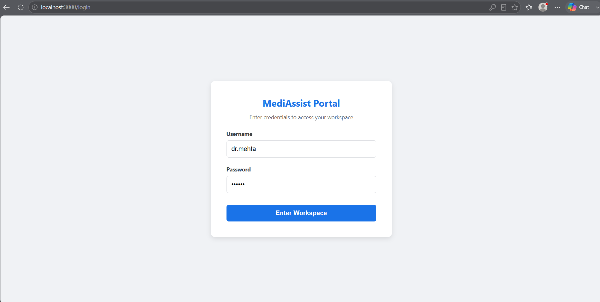

The MediAssist Portal login page (`/login`). Users enter their credentials (username + password) to authenticate. On success, the server returns their role which is stored in the browser and used to enforce collection-level access for the rest of the session.

---

### 🏠 Chat Workspace — Doctor Logged In

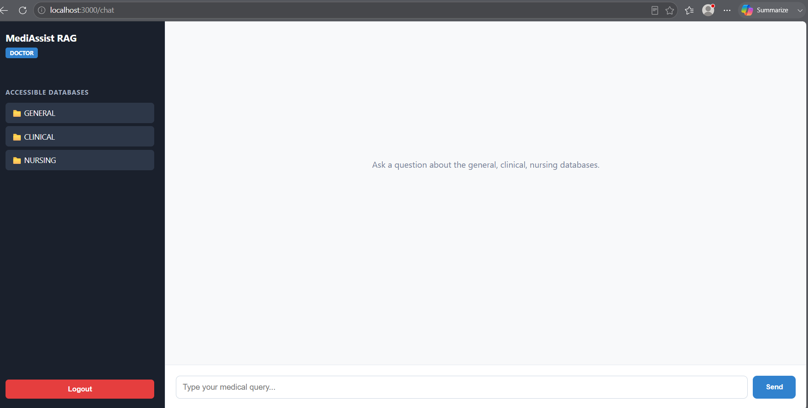

The chat workspace after a doctor (`dr.mehta`) logs in. The left sidebar shows the role badge (**DOCTOR**) and dynamically lists only the accessible database collections — **GENERAL**, **CLINICAL**, and **NURSING**. The chat area prompts the user to ask questions about those specific databases.

---

### 🔍 Hybrid RAG — Doctor Asking Clinical Questions

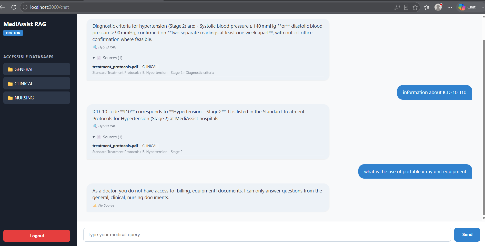

A doctor session with multiple queries. Clinical questions (hypertension, ICD-10: I10) are answered via **Hybrid RAG** with a `🔍 Hybrid RAG` badge and a collapsible **Sources** panel showing the source document (`treatment_protocols.pdf`), collection (`CLINICAL`), and full heading breadcrumb. The third question ("what is the use of portable x-ray unit equipment") targets the restricted `equipment` collection and returns an `⚠️ No Source` access-denied message.

---

### 🚫 Doctor — Repeated Access Denial for Restricted Collections

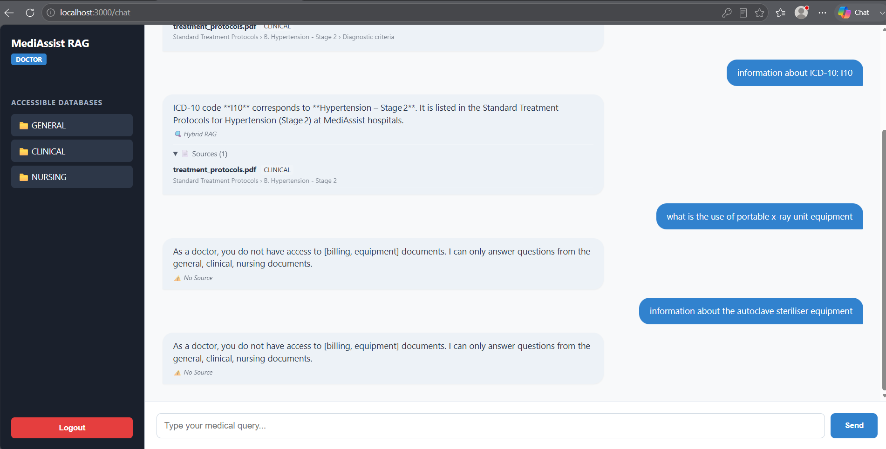

Demonstrates consistent role enforcement across multiple restricted queries. Both "portable x-ray unit equipment" and "autoclave steriliser equipment" (equipment collection) return: *"As a doctor, you do not have access to [billing, equipment] documents."* — each with an `⚠️ No Source` badge. This confirms the Qdrant `metadata.collection` filter is working correctly at query time.

---

### 📊 Admin — SQL RAG + Hybrid RAG in the Same Session

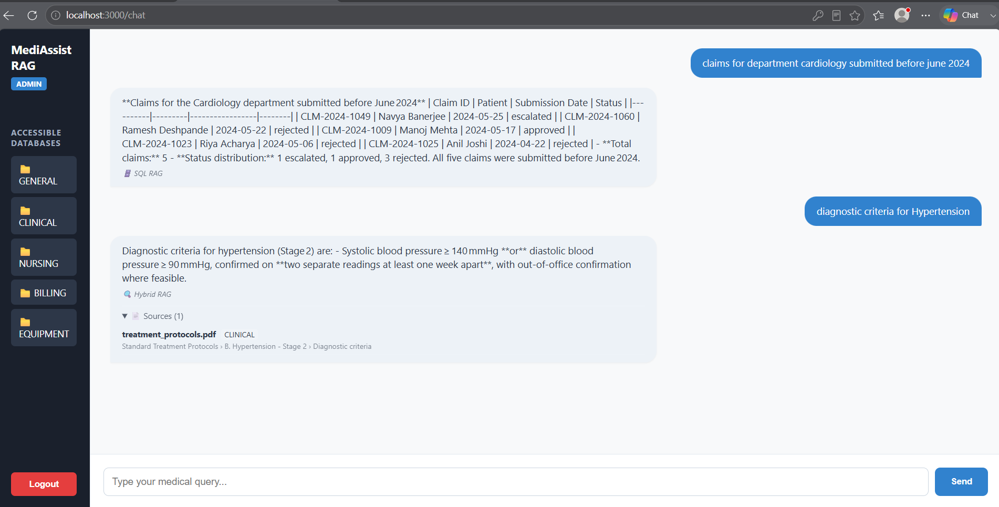

An admin session demonstrating both RAG pipelines working together. The first query ("claims for department cardiology submitted before june 2024") triggers the **SQL RAG** pipeline — the LLM generates a SQL `SELECT` query, executes it on the SQLite claims database, and returns a formatted result table with a `🗄️ SQL RAG` badge. The second query ("diagnostic criteria for Hypertension") is answered via **Hybrid RAG** from `treatment_protocols.pdf` with a source citation.

---

### 🗄️ Admin — SQL RAG Close-Up

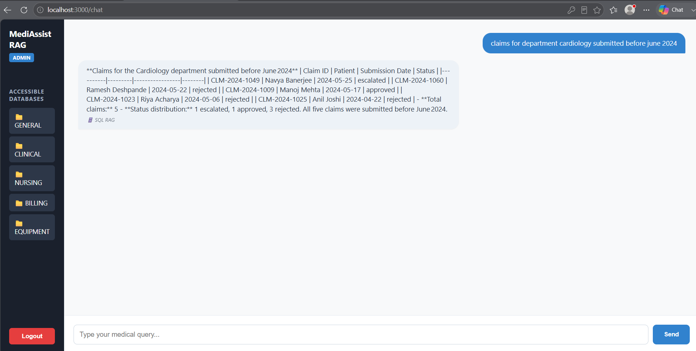

Close-up of the SQL RAG response for the admin role. The query returns 5 cardiology claims submitted before June 2024 with their claim IDs, patient names, submission dates, and statuses (1 escalated, 1 approved, 3 rejected). The `🗄️ SQL RAG` badge confirms the retrieval type. No source documents are listed since the answer came from structured database data, not PDF chunks.

---

### 🔎 Admin — SQL Fallback with No Matching Data

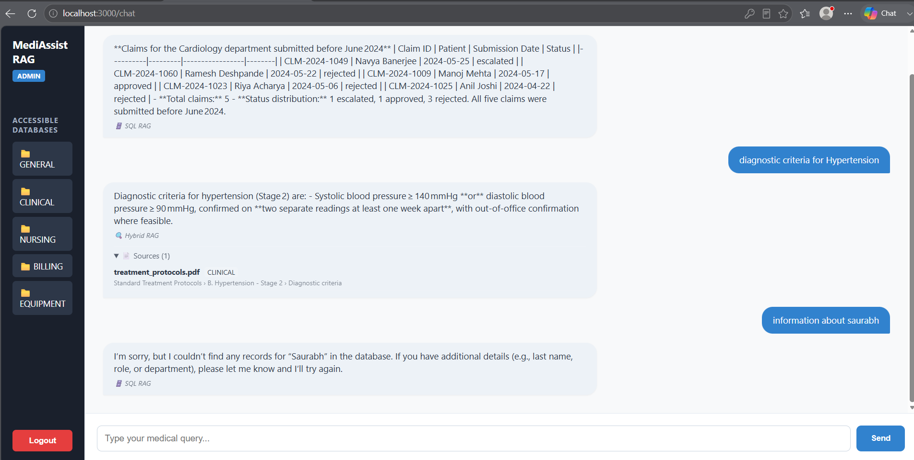

Shows the SQL RAG fallback behaving gracefully when a query returns no database records. The admin asks "information about saurabh" — the SQL chain runs but finds no matching employee/claim. The LLM acknowledges this and prompts for more identifying details. The `🗄️ SQL RAG` badge is shown because the SQL pipeline was invoked, even though no data was returned.

---

### 🔧 Technician — Accessing Equipment Collection

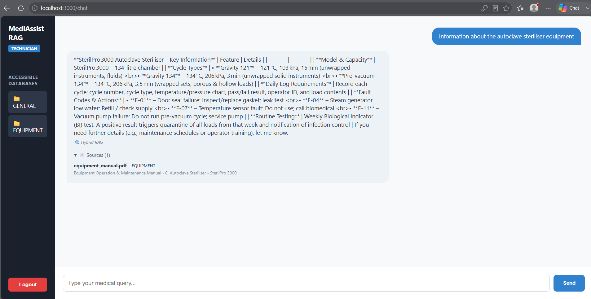

A technician (`tech.anand`) logged in with access to only **GENERAL** and **EQUIPMENT** collections. The query "information about the autoclave steriliser equipment" is answered from `equipment_manual.pdf` via Hybrid RAG. The source panel shows the document, collection badge (`EQUIPMENT`), and section path (`Equipment Operation & Maintenance Manual › C. Autoclave Steriliser – SterilPro 3000`), demonstrating that equipment-restricted documents are fully accessible to the technician role.

---

### 🚫 Technician — Access Denied for Clinical and Billing Data

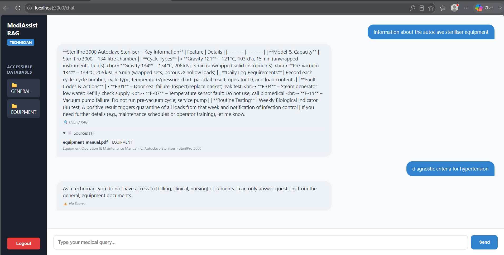

A technician attempting to access restricted collections. "Diagnostic criteria for hypertension" (clinical) and "autoclave steriliser information" (equipment — allowed) are contrasted: the equipment query is answered but the hypertension query returns *"As a technician, you do not have access to [billing, clinical, nursing] documents."* This illustrates the per-role filtering working symmetrically — same query, different role, different result.

---

### 🔍 Hybrid RAG — Source Citation Panel Detail

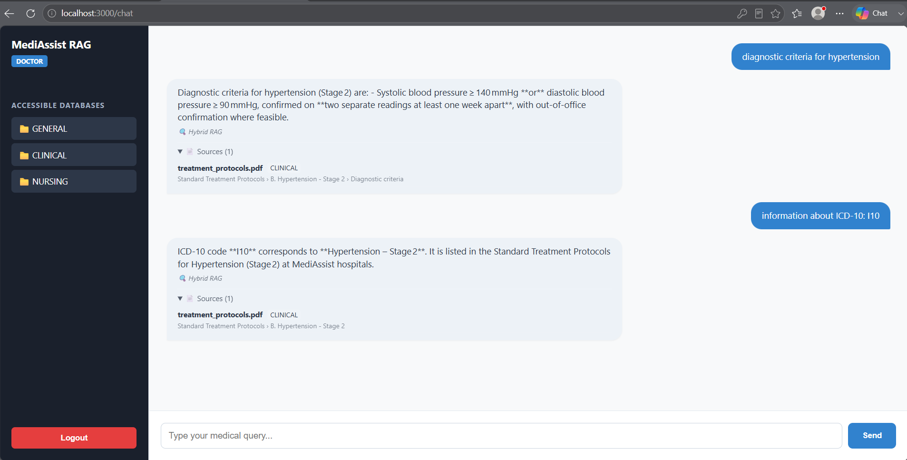

Detailed view of the Hybrid RAG source citation feature for a doctor. Two consecutive queries ("diagnostic criteria for hypertension" and "information about ICD-10: I10") both retrieve from `treatment_protocols.pdf` in the clinical collection. Each response bubble shows the collapsible **Sources (1)** panel with the filename, collection tag, and full section breadcrumb, giving full traceability from answer back to the original document section.

---

### 🚫 Technician — SQL and Clinical Queries All Blocked

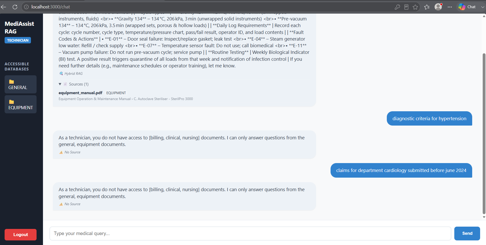

A complete technician session showing the access control chain end-to-end: the technician first gets a valid equipment answer via Hybrid RAG, then asks "diagnostic criteria for hypertension" (clinical — blocked) and "claims for department cardiology submitted before june 2024" (billing/SQL — blocked). Both return the `⚠️ No Source` access-denied message, confirming that the Qdrant collection filter and the SQL fallback guard both enforce role restrictions correctly.

---

## Adversarial Prompt Examples

These examples demonstrate how the system handles queries that cross role-access boundaries. In each case the user is **authenticated and active** — the enforcement happens silently at the vector retrieval layer, not at login.

---

### Example 1 — Doctor Probing the Equipment Collection

> **Scenario**: A doctor (role: `doctor`, access: `general`, `clinical`, `nursing`) asks about hospital equipment managed exclusively by technicians.

**Request**
```
what is the use of portable x-ray unit equipment
```

**Response**
```
As a doctor, you do not have access to [billing, equipment] documents.
I can only answer questions from the general, clinical, nursing documents.
```

**Retrieval type:** `⚠️ No Source`

**Why it's blocked**: The `equipment` collection is not in the doctor's `ROLE_ACCESS_MAPPING`. The Qdrant filter (`metadata.collection IN ["general", "clinical", "nursing"]`) returns zero results for equipment queries. The LLM responds with "I don't have that information." which triggers the access-denied fallback.


---

### Example 2 — Technician Trying to Access Clinical Treatment Protocols

> **Scenario**: A technician (role: `technician`, access: `general`, `equipment`) asks a clinical question that is only available to doctors, nurses, and admins.

**Request**
```
diagnostic criteria for hypertension
```

**Response**
```
As a technician, you do not have access to [billing, clinical, nursing] documents.
I can only answer questions from the general, equipment documents.
```

**Retrieval type:** `⚠️ No Source`

**Why it's blocked**: `treatment_protocols.pdf` is stored in the `clinical` collection with `access_roles: ["doctor", "admin", "nurse"]`. The technician's Qdrant filter (`metadata.collection IN ["general", "equipment"]`) excludes it entirely — the document is never even retrieved, so the LLM has no context to answer from.


---

### Example 3 — Technician Probing Billing / SQL Claims Data

> **Scenario**: A technician asks a structured query about hospital claims — a dataset only accessible to `admin` and `billing_executive` roles via the SQL RAG pipeline.

**Request**
```
claims for department cardiology submitted before june 2024
```

**Response**
```
As a technician, you do not have access to [billing, clinical, nursing] documents.
I can only answer questions from the general, equipment documents.
```

**Retrieval type:** `⚠️ No Source`

**Why it's blocked**: This query fails at two levels:
1. **Hybrid RAG** — no `billing` or `clinical` documents are retrievable for the technician role (Qdrant filter blocks them).
2. **SQL RAG fallback** — only invoked for `admin` and `billing_executive`; the technician role never reaches the SQL chain. The fallback message is returned immediately.


---

### Example 4 — Doctor Asking About Autoclave Steriliser (Equipment)

> **Scenario**: A doctor attempts to retrieve equipment maintenance information that is restricted to technicians and admins.

**Request**
```
information about the autoclave steriliser equipment
```

**Response**
```
As a doctor, you do not have access to [billing, equipment] documents.
I can only answer questions from the general, clinical, nursing documents.
```

**Retrieval type:** `⚠️ No Source`

**Why it's blocked**: Despite the query being medically plausible for a doctor (autoclaves sterilise surgical instruments), the information lives in `equipment_manual.pdf` which is in the `equipment` collection restricted to `["technician", "admin"]`. The Qdrant filter enforces this regardless of the semantic content of the query — the source collection is the deciding factor, not the topic.


---

### Adversarial Pattern Summary

| Role | Adversarial Query | Blocked By | Response Type |
|---|---|---|---|
| `doctor` | equipment query (x-ray, autoclave) | Qdrant collection filter | `⚠️ No Source` fallback |
| `technician` | clinical query (hypertension, ICD-10) | Qdrant collection filter | `⚠️ No Source` fallback |
| `technician` | billing/SQL query (claims data) | Role check before SQL chain | `⚠️ No Source` fallback |
| `admin` | unknown entity query ("saurabh") | SQL returns empty result | SQL RAG graceful "no records" |

> 💡 **Key design principle**: Enforcement happens at the **retrieval layer** (Qdrant filter), not the response layer. The LLM never sees restricted documents — it cannot be prompted to reveal them even if a user crafts a clever jailbreak query, because the documents are simply absent from the context window.
